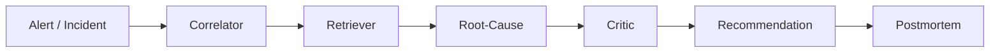

# Sentinel AI

**Autonomous incident investigation — where every claim is cited to real evidence.**

Sentinel AI takes a production incident (metrics, logs, deploy history), gathers
structured evidence, retrieves relevant runbook guidance, proposes and
*adversarially falsifies* root-cause hypotheses, and produces a grounded
remediation and a cited postmortem — end to end, over live telemetry.

Its defining rule: **no agent may make a claim without a `source_ref` that
resolves to real evidence.** This is enforced in code, not just asked for in a
prompt — unresolved citations are stripped and unsupported hypotheses dropped.

---

## Highlights

- **Multi-agent pipeline** with a hard citation-validation guarantee.
- **Runs on live telemetry**: an alert triggers an investigation built from
  real Prometheus metrics + a service's logs and deploys.
- **Async by design**: `/alert` enqueues on Redis; a Celery worker runs the
  ~20s pipeline off the request path and writes results to Postgres.
- **Hybrid RAG**: dense vectors + BM25 keyword search fused via Reciprocal Rank
  Fusion, over a Qdrant store.
- **Pluggable embeddings**: local (sentence-transformers) for dev, or the hosted
  Jina API for a light (~250 MB, no-torch) deploy image.
- **One-command stack**: 8 services via `docker compose up`, with health-gated
  startup and a Streamlit cockpit to drive the whole demo.
- **CI**: GitHub Actions runs lint + an offline test suite + Docker build checks.

## How it works



- **Correlator** — rule-based anomaly detection over metrics/logs/deploys (cheap
  and reliable; evidence grounded in arithmetic, not a model's guess).
- **Retriever** — hybrid search over runbooks; each hit cites the exact section.
- **Root-Cause** — LLM proposes ranked hypotheses, each citing real evidence.
- **Critic** — adversarial pass that tries to *break* each hypothesis.
- **Recommendation** — a grounded fix, or an explicit escalation if it can't
  ground one.
- **Postmortem** — deterministic, fully-cited report (no new facts invented).

For a **live** incident, an ingestion adapter turns an alert (`service` + metric
+ window) into the same incident shape the agents already speak, by querying
Prometheus and the target's `/logs` and `/deploys`.

## Tech stack

FastAPI · Celery + Redis · PostgreSQL · Qdrant · Prometheus · Streamlit ·
Groq LLMs (`gpt-oss-20b` / `120b`) · Jina / sentence-transformers embeddings ·
Docker Compose · GitHub Actions

**Services** (`docker compose`): `app` (API), `worker` (Celery), `cockpit`
(Streamlit UI), `dummy` (a fault-injecting target service), `prometheus`,
`qdrant`, `postgres`, `redis`.

## Quick start

```bash
cp .env.example .env
# set GROQ_API_KEY, JINA_API_KEY, and a strong POSTGRES_PASSWORD
docker compose up -d --build
```

Then open the cockpit at **http://localhost:8501** — inject one of 12
manufactured faults, watch the live telemetry move, run an investigation, and
browse the persisted history. The stack self-ingests the runbooks on first boot.

## The demo cockpit

One screen to drive everything: service status, one-click fault injection (and
heal), live Prometheus telemetry, run a full investigation on the live incident,
and a Postgres-backed history you can click into for the full cited report.

## API

| Route | What it does |
| --- | --- |
| `POST /alert` | Investigate a live incident (async — returns a job id to poll). |
| `POST /investigate` / `/investigate/{id}` | Run a full investigation (sync). |
| `GET /investigations` / `/investigations/{id}` | History + one run's full result. |
| `GET /incidents` · `GET /health` | Catalogue ids · liveness. |

## Testing

```bash
pip install -r requirements-local.txt   # base deps + local embedder + pytest
pytest                                    # offline: no keys, no services needed
```

## Project layout

```
app/
  agents/      correlator, root_cause, critic, recommendation, postmortem
  retrieval/   chunking, embeddings (pluggable), ingest, hybrid search
  ingestion/   live-telemetry adapter + incident loader
  db/          SQLAlchemy models + repository (investigation history)
  schemas/     the EvidenceObject / ledger contract
  tasks.py     Celery async task     pipeline.py   the orchestrator
  main.py      FastAPI app
eval/          non-LLM scoring harness + batch runner
dummy/         the fault-injecting target service
ui/            the Streamlit cockpit
```

## Status & notes

A portfolio project, not a hardened product. It runs as a single-node
`docker compose` stack; the datastores aren't exposed on the host and the
Postgres password comes from `.env`. The API and cockpit have no auth yet — put
them behind a reverse proxy (or IP allowlist) for a public deploy.
